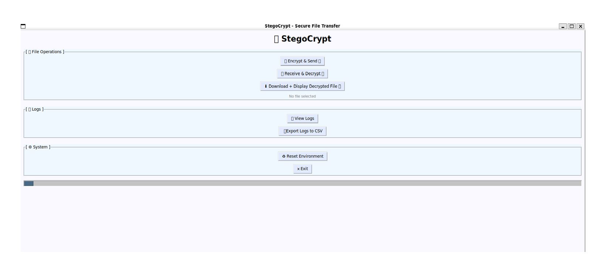
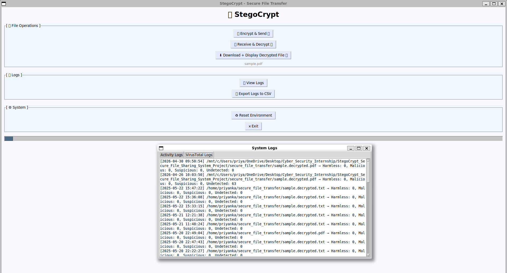

# StegoCrypt - Secure File Sharing System with Integrated Threat Detection

A secure file transfer system that ensures confidentiality, integrity, and authenticity using encryption, steganography, and malware detection.
StegoCrypt is a Python-based tool for **secure file transmission** that combines:
- Symmetric & asymmetric encryption
- Steganography (hiding data in images)
- Digital signatures for integrity
- VirusTotal threat detection
- Real-time file monitoring
- Push notifications for suspicious activity
- User-friendly GUI
- Complete logging to SQLite

---

## Problem Statement

Traditional file transfer methods are vulnerable to:
- Data interception
- File tampering
- Malware injection

StegoCrypt solves this by combining:
- AES Encryption (Fernet)
- RSA Encryption (Key Exchange)
- Digital Signatures
- Steganography (data hiding inside images)
- Malware Scanning (VirusTotal API)
- Real-time Notifications

---

## Features

- AES (Fernet) Symmetric Encryption
- RSA Asymmetric Key Pair & Digital Signature
- Steganography using Steghide
- Encrypted Stego Password Sharing
- Automatic ZIP Packaging for Transfer
- VirusTotal File Scan Integration
- Pushbullet Notifications
- Real-Time File Monitoring
- SQLite Logging + CSV Export
- Tkinter GUI with Reset Environment Option
- File Integrity Check (SHA-256)

---

## Project Structure

secure_file_transfer/ │
├── main.py                   # Entry point to launch GUI 
├── gui.py                    # Main GUI logic (Tkinter) 
├── encryption.py             # Symmetric encryption + RSA signature 
├── steganography.py          # File embedding/extraction via Steghide 
├── network.py                # Simulated file transfer 
├── notifier.py               # Pushbullet alert system 
├── logger.py                 # Logs to SQLite (activity + scan results) 
├── utils.py                  # VirusTotal scan, MIME checks, hashing 
├── receiver_keys.py          # Generates receiver RSA key pair 
├── requirements.txt          # All Python dependencies 
├── README.md                 # Project documentation 
├── database.db               # SQLite DB created automatically 
├── received/                 # Simulated receiver folder 
└── venv/                     # Virtual environment

---

## Installation 

1. Clone the repository:
    git clone https://github.com/yourusername/StegoCrypt.git
    cd StegoCrypt

2. Set up the virtual environment:
                                  python3 -m venv venv
                                  source venv/bin/activate

3. Install dependencies:
                        pip install -r requirements.txt {if this fails use below command}
                        python -m pip install -r requirements.txt
                        
4. Install steghide(required for embedding data):
                                                  sudo apt install steghide

---

## How to Use
   **Run the GUI:**
                python main.py

**Options from GUI:**
                  Encrypt & Send: Encrypts, signs, and hides the file in an image. Sends the stego image + encrypted passphrase.

                  Receive & Decrypt: Extracts, verifies, decrypts, scans, and monitors the file.

                  View Logs: See VirusTotal and event logs.

                  Export Logs to CSV: Downloads activity + scan results to logs_output.csv.

                  Reset Environment: Deletes temp files and optionally keys.

                  Exit: Closes the GUI.

---

## Configuration

**Pushbullet API Token:**
Replace the placeholder in notifier.py:
                                    PB_ACCESS_TOKEN = "your_actual_token_here"

**VirusTotal API Key:**
Set your API key in gui.py or utils.py:
                                    VIRUSTOTAL_API_KEY = "your_actual_key_here"

---

## Key Concepts Used

- Hybrid Encryption (AES + RSA)
- Digital Signatures
- Steganography
- File Integrity Verification
- Malware Detection APIs
- Event-driven Programming
- Multithreading (file monitoring)

---

## Technologies Used

- Language: Python
- GUI: Tkinter
- Encryption: Cryptography Library
- Steganography: Steghide
- Database: SQLite
- APIs: VirusTotal, Pushbullet
- Monitoring: inotify
- Others: python-magic, requests

---

## Application Flow

🔒 Sender Side                              📥 Receiver Side
1. Select file                                  1. Receive file
2. Encrypt file (AES)                           2. Extract image
3. Sign file (RSA)                              3. Decrypt passphrase
4. Generate hash                                4. Extract hidden data
5. Zip files                                    5. Verify signature
6. Hide inside image                            6. Decrypt file
7. Encrypt passphrase                           7. Scan for malware
8. Send package                                 8. Validate integrity
                                                9. Monitor file
                                                10. Send notification
Application Flow Diagram

User
 ↓
GUI (Tkinter)
 ↓
Encryption (AES + RSA)
 ↓
Steganography (Steghide)
 ↓
Network (Simulated Transfer)
 ↓
Receiver
 ↓
Extraction → Decryption → Virus Scan
 ↓
Validation → Logging → Notification

---

⚙️ Prerequisites

- Python 3.8+
- Linux (recommended for steghide & inotify)
- Steghide installed
- Internet connection (for APIs)

---

📦 Installation

git clone https://github.com/YOUR_USERNAME/StegoCrypt.git
cd StegoCrypt
python -m venv venv
source venv/bin/activate   # Linux
venv\Scripts\activate      # Windows
pip install -r requirements.txt
sudo apt install steghide

---

🔑 Environment Setup

Create a ".env" file in the root directory:

PUSHBULLET_TOKEN=your_token_here

---

▶️ Quick Start

python main.py

---

📸 Snapshots

Create an "assets/" folder and add images:

assets/
 ├── gui.png
 ├── logs.png

Add in README:

---

📊 Logs

- Stored in "database.db"
- Exportable as CSV ("logs_output.csv")

---

🔐 Security Notes

- Uses Hybrid Encryption (AES + RSA) for strong security
- Digital signatures ensure authenticity and non-repudiation
- SHA-256 ensures file integrity
- VirusTotal API provides multi-engine malware scanning
- Steganography hides sensitive data from attackers

⚠️ Note:

- This project is for educational purposes only
- Not intended for production use without enhancements

---

🚀 Future Enhancements

- Real-time file transfer using sockets / REST APIs
- Cloud storage integration (AWS / Firebase)
- User authentication system
- Replace Pushbullet with Firebase Cloud Messaging
- Web-based UI

---

📂 Project Structure

secure_file_transfer/
│── encryption.py
│── steganography.py
│── network.py
│── gui.py
│── logger.py
│── notifier.py
│── utils.py
│── main.py
│── database.db
│── assets/

---

💼 Interview Highlights

- Multi-layer security architecture
- Hybrid encryption implementation
- Real-world API integration
- Event-driven GUI system
- File monitoring + real-time alerts

---

🎥 Demo (Optional)

Add your demo video link here:

https://your-demo-link.com

---

⭐ If you like this project

Give it a ⭐ on GitHub!

