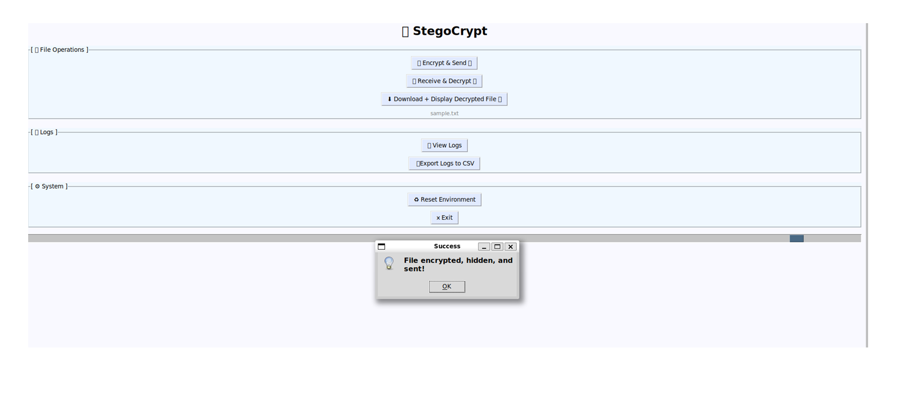
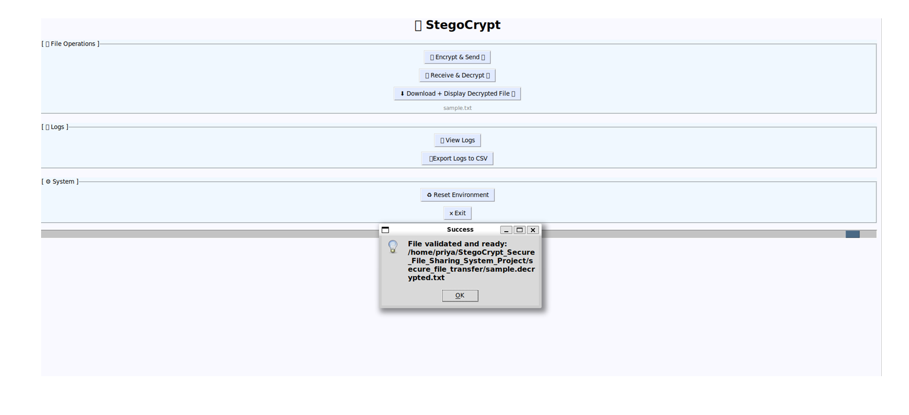
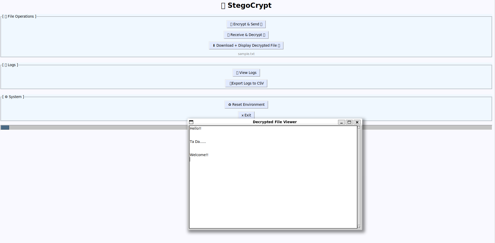
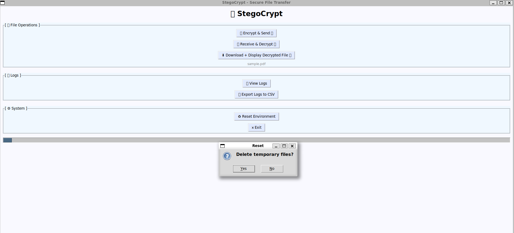
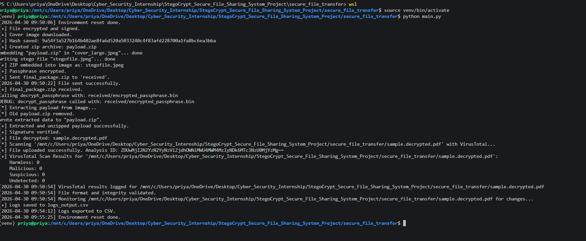
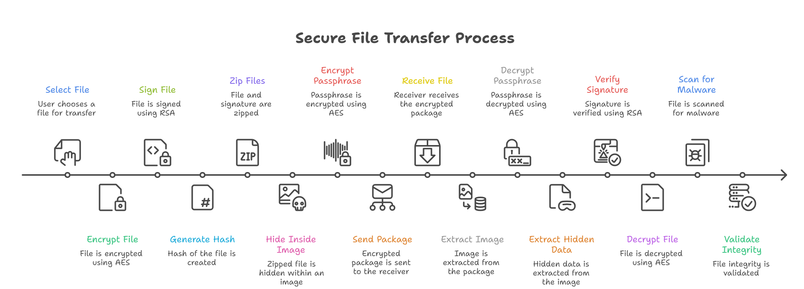

# StegoCrypt - Secure File Sharing System with Integrated Threat Detection
> 🚀 A multi-layered secure file transfer system combining encryption, steganography, and malware detection for end-to-end protection.

A secure file transfer system that ensures confidentiality, integrity, and authenticity using encryption, steganography, and malware detection.
StegoCrypt is a Python-based tool for **secure file transmission** that combines:
- Symmetric & asymmetric encryption
- Steganography (hiding data in images)
- Digital signatures for integrity
- VirusTotal threat detection
- Real-time file monitoring
- Push notifications for suspicious activity
- User-friendly GUI
- Complete logging to SQLite

---

## Problem Statement

Traditional file transfer methods are vulnerable to:
- Data interception
- File tampering
- Malware injection

This system addresses these issues using:
- AES Encryption (Fernet)
- RSA Encryption (Key Exchange)
- Digital Signatures
- Steganography (data hiding inside images)
- Malware Scanning (VirusTotal API)
- Real-time Notifications

---

## Project Screenshots

### Home Page


### Encrypt & Send


### Receive & Decrypt 


### Download & View File


### View Logs 


### Reset Environment


### Terminal/Backend


## Features

- AES (Fernet) Symmetric Encryption
- RSA Asymmetric Key Pair & Digital Signature
- Steganography using Steghide
- Encrypted Stego Password Sharing
- Automatic ZIP Packaging for Transfer
- VirusTotal File Scan Integration
- Pushbullet Notifications
- Real-Time File Monitoring
- SQLite Logging + CSV Export
- Tkinter GUI with Reset Environment Option
- File Integrity Check (SHA-256)

---

## Key Concepts Used

- Hybrid Encryption (AES + RSA)
- Digital Signatures
- Steganography
- File Integrity Verification
- Malware Detection APIs
- Event-driven Programming
- Multithreading (file monitoring)

---

## Technologies Used

- Language: Python
- GUI: Tkinter
- Encryption: Cryptography Library
- Steganography: Steghide
- Database: SQLite
- APIs: VirusTotal, Pushbullet
- Monitoring: inotify
- Others: python-magic, requests

---

## Project Structure
```
secure_file_transfer/ 
├── main.py                   # Entry point to launch GUI 
├── gui.py                    # Main GUI logic (Tkinter) 
├── encryption.py             # Symmetric encryption + RSA signature 
├── steganography.py          # File embedding/extraction via Steghide 
├── network.py                # Simulated file transfer 
├── notifier.py               # Pushbullet alert system 
├── logger.py                 # Logs to SQLite (activity + scan results) 
├── utils.py                  # VirusTotal scan, MIME checks, hashing 
├── receiver_keys.py          # Generates receiver RSA key pair 
├── requirements.txt          # All Python dependencies 
├── README.md                 # Project documentation 
├── database.db               # SQLite DB created automatically 
├── received/                 # Simulated receiver folder 
├─venv/                       # Virtual environment
└── assets/
    ├── decrypted.png
    ├── downloaded_file.png
    ├── encrypted.png               
    ├── flowchart.png            
    ├── flowchart_.png
    ├── gui.png
    ├── logs.png               
    ├── reset.png            
    └── terminal.png         
```

---

## Installation

### 1. Clone the repository
```bash
        git clone 
        https://github.com/YOUR_USERNAME/StegoCrypt.git
        cd StegoCrypt
```

### 2. Create virtual environment
```bash
        python3 -m venv venv
        source venv/bin/activate     # Linux
        venv\Scripts\activate        # Windows
```

### 3. Install dependencies
```bash
        pip install -r requirements.txt
```

### 4. Install steghide
```bash
        sudo apt install steghide
```

### 5. Environment Setup
Create a `.env` file:
```env
    PUSHBULLET_TOKEN=your_token_here
```
---

## Configuration

### Pushbullet Token
Create a `.env` file:
```env 
    PUSHBULLET_TOKEN= your_token_here  (Replace the placeholder in notifier.py)
```

### VirusTotal API Key
Update in `gui.py`:
```python
        VIRUSTOTAL_API_KEY = your_actual_key_here  (Set your API key in gui.py or utils.py)
```

---

## How to Use
### Run the application
```bash
        python main.py
```

**Options from GUI:**
                  Encrypt & Send: Encrypts, signs, and hides the file in an image. Sends the stego image + encrypted passphrase.

                  Receive & Decrypt: Extracts, verifies, decrypts, scans, and monitors the file.

                  View Logs: Displays VirusTotal and event logs.

                  Export Logs to CSV: Downloads activity + scan results to logs_output.csv.

                  Reset Environment: Deletes temporary files and optionally keys.

                  Exit: Closes the Application.

---

## Application Flow

```
User
 ↓
GUI (Tkinter)
 ↓
Encryption (AES + RSA)
 ↓
Steganography (Steghide)
 ↓
Network (Simulated Transfer)
 ↓
Receiver
 ↓
Extraction → Decryption → Virus Scan
 ↓
Validation → Logging → Notification
```

## Logs

- Stored in "database.db"
- Exportable as CSV ("logs_output.csv")

---

## Security Notes

- Uses Hybrid Encryption (AES + RSA) for strong security
- Digital signatures ensure authenticity and non-repudiation
- SHA-256 ensures file integrity
- VirusTotal API provides multi-engine malware scanning
- Steganography hides sensitive data from attackers

⚠️ Note:

- This project is for educational purposes only
- Not intended for production use without enhancements

---

## Future Enhancements

- Real-time file transfer using sockets / REST APIs
- Cloud storage integration (AWS / Firebase)
- User authentication system
- Replace Pushbullet with Firebase Cloud Messaging
- Web-based UI

---


